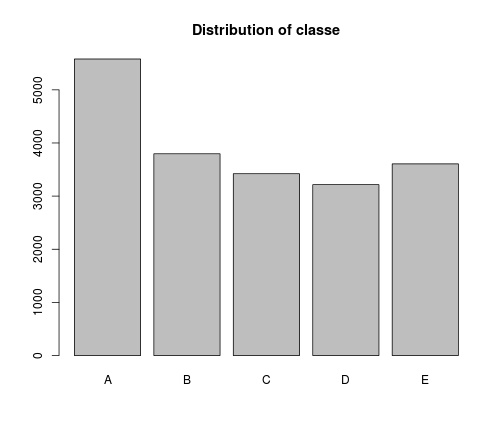

Weight Lifting Sensor Data Analysis
===================================

This analysis attempts to propose the construction of the predictor for weight lifting sensory data. We propose random forest based model because of high accuracy returned by it and fairly decent execution time.


```r
set.seed(3885)
library(caret)
```

```
## Loading required package: lattice
## Loading required package: ggplot2
```

```r
library(doMC)
```

```
## Loading required package: foreach
## Loading required package: iterators
## Loading required package: parallel
```


In order to leverage parallel execution, and therefore decrease the execution time, we use multicore package which if registerd
would be used by **train** to load balance the work on multiple workers (in our case 4). 

```r
registerDoMC(cores = 4)
```


## Exploratory Data Analysis

We read in **training.csv** file that will serve as a basis of our analysis. File **testing.csv** would be used to produce prediction for submission.

```r
data <- read.csv("data/training.csv")
submission_data <- read.csv("data/testing.csv")
```


We noticed that the data set contains verbose column **X** which contains all unique values (probably being an index that was saved by the creators of the data set) enumerating rows. We can freely drop this column since it would not add anything to our analysis. 

```r
data <- data[, -c(1)]
```


Then we split it to proper training and testing set that would be used for model fitting and model evaluation respectively.

```r
inTrain <- createDataPartition(y = data$classe, p = 0.6, list = FALSE)
training <- data[inTrain, ]
testing <- data[-inTrain, ]
```


Furthermore one can take a look at the original data set and just to measure how well the **classe** variable is spread among sample data, so visually confirm that it's fairly equally distributed.

```r
classe_dict <- aggregate(raw_timestamp_part_1 ~ classe, data = data, FUN = length)
barplot(classe_dict$raw_timestamp_part_1, names.arg = classe_dict$classe)
title("Distribution of classe")
```

 


Since we deal with quite a big amount of features (columns) one can drop those that contain large amount of **NAs**. We decided to go with arbiterly chosen value 0.03 which serve as a threshold for dropping the almost empty columns:

```r
not.na <- apply(training, 2, function(col) {
    1 - sum(is.na(col))/nrow(training)
}) > 0.03
training <- training[, not.na]
```


Futhermore we can get rid of few more coulmns by simply selecting those with extremly low variablity:

```r
nzv <- nearZeroVar(training, saveMetrics = TRUE)
exclude_nzv <- rownames(subset(nzv, nzv == TRUE))
training <- training[, -which(names(training) %in% exclude_nzv)]
```


## Training

After quick exploration with regards to the type of model to be used during the training we decided to go with random forest. 

We tried simple decision tree but it's initial results were far from satisfactory. Additionally we gave a try to boosting algorithm but it failed due to memory error. 

By default random forest model will use bootstrapping with 25 samples which is more than enough to assure decent cross validation during the training phase. 

The accuracy of the fitted model on the training set is incredibly high (around: 0.99) which on the first sight could suggest some serious overfitting that takes place during the training phase but as we show later testing data (out of sample error) prove that actually the model is incredibly successful and it's accuracy is not due to overfitting. 


```r
modFit <- train(classe ~ ., data = training, method = "rf")
```

```
## Loading required package: randomForest
## randomForest 4.6-7
## Type rfNews() to see new features/changes/bug fixes.
```

```r
modFit$finalModel$confusion
```

```
##      A    B    C    D    E class.error
## A 3348    0    0    0    0   0.0000000
## B    3 2275    1    0    0   0.0017552
## C    0    8 2045    1    0   0.0043817
## D    0    0    1 1928    1   0.0010363
## E    0    0    0    2 2163   0.0009238
```


Curiously enough one could try to invesitgate deeply what's the reason behind such an incredible performance by looking at the variable importance and discover the most important is **raw_timestamp_part_1** suggesting that maybe we have a variable (column) that should be excluded from the analysis since in our opinion it was included accidently by the authors of the data set.

```r
varImp(modFit)
```

```
## Loading required package: randomForest
## randomForest 4.6-7
## Type rfNews() to see new features/changes/bug fixes.
```

```
## rf variable importance
## 
##   only 20 most important variables shown (out of 79)
## 
##                                Overall
## raw_timestamp_part_1            100.00
## roll_belt                        45.53
## num_window                       44.27
## pitch_forearm                    27.66
## magnet_dumbbell_z                18.99
## magnet_dumbbell_y                15.94
## pitch_belt                       13.40
## yaw_belt                         13.18
## cvtd_timestamp30/11/2011 17:12   11.01
## cvtd_timestamp02/12/2011 14:58   10.25
## roll_forearm                     10.05
## cvtd_timestamp02/12/2011 13:33    8.36
## magnet_dumbbell_x                 7.77
## cvtd_timestamp28/11/2011 14:15    6.99
## roll_dumbbell                     6.59
## magnet_belt_y                     6.11
## accel_belt_z                      5.93
## accel_dumbbell_y                  5.60
## accel_forearm_x                   5.07
## cvtd_timestamp05/12/2011 14:24    5.01
```


## Evaluation

We measure a performance of our predictive model on the hold-out set (part of the initial data). Again the final accuracy on the testing set is very high and it's around: 0.99. 

```r
predictions <- predict(modFit, newdata = testing)
confusionMatrix(predictions, testing$classe)$table
```

```
##           Reference
## Prediction    A    B    C    D    E
##          A 2232    0    0    0    0
##          B    0 1518    3    0    0
##          C    0    0 1365    1    0
##          D    0    0    0 1285    1
##          E    0    0    0    0 1441
```


## Submission

As a final step we generate submission files:

```r
answers <- predict(modFit, newdata = submission_data)
pml_write_files = function(x) {
    n = length(x)
    for (i in 1:n) {
        filename = paste0("./answers/problem_id_", i, ".txt")
        write.table(x[i], file = filename, quote = FALSE, row.names = FALSE, 
            col.names = FALSE)
    }
}
pml_write_files(answers)
```

